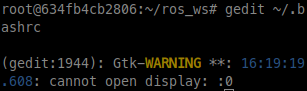
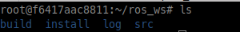
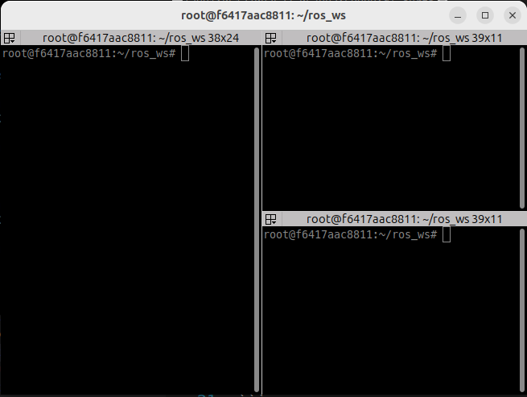
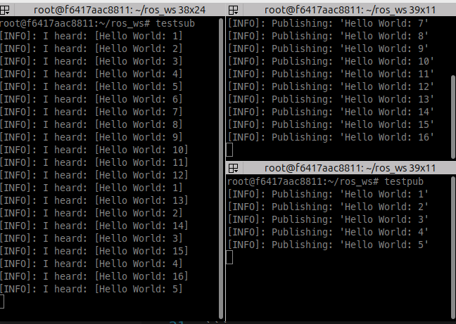
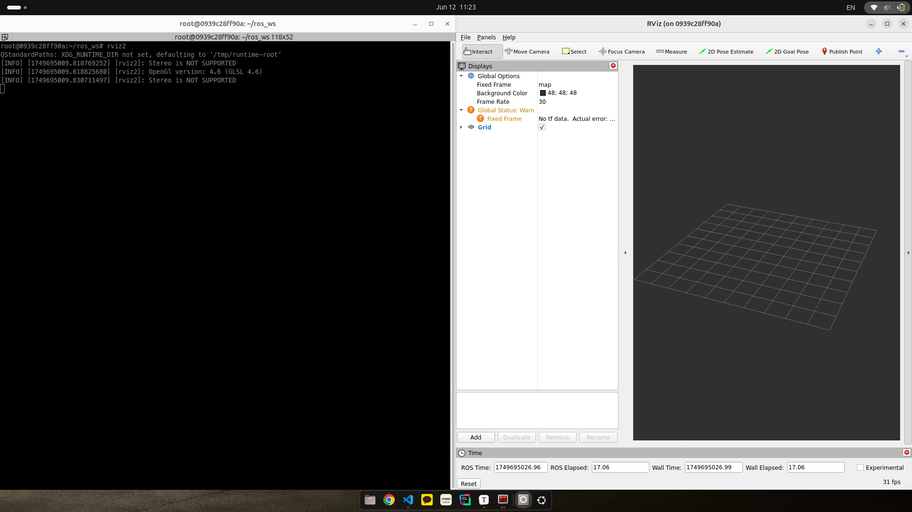

<br>

------


> [!IMPORTANT]
>
> **"ROS2 개발 환경을 Docker container로 구축하고자 하는 이유는 현재 내 데스크탑과 노트북은 서로 다른 UBUNTU 버전을 사용하고 있고 이미 중요한 파일이나 구축해 높은 개발 환경이 존재하기에 밀어버리기 힘든 상황이다. 따라서, 새로운 버전의 UBUNTU를 설치하지 않고 개발 환경을 구축하기 위해 Docker를 사용한 것이다."**

------

<br>

<br>

## ROS Image Download

------

Docker Hub에서 ROS Image를 찾아 다운 받을 수 있다. 

여러 ROS 버전 중 ROS2의 Humble을 사용하고자 하기에 해당 버전의 image를 pull을 통해 다운받았다. 

```bash
$ docker pull osrf/ros:humble-desktop-full
```

뿐만 아니라 ROS1의 noetic이나 melodic image를 다운 받고 싶다면 humble-desktop-full에서 humble대신 원하는 버전을 입력하면 된다. 

<br>

## Docker Container 생성

------

Docker Hub에서 원하는 버전의 ros Image를 다운 받았다면 이번에는 해당 이미지를 기반으로 container를 생성할 것이다. 

우선, 내가 원하는 개발환경에 맞는 Container를 생성하기 위해서 아래와 같이 docker run 명령어를 사용하되 몇가지 옵션을 추가할 것이다.

*(이 중에는 사용하지 않을 옵션들이 있지만 이런 것도 있구나해서 이것저것 추가한 것이다.)*

```bash
$ docker run -it \
	--rm \
	--privileged \
	--env DISPLAY=$DISPLAY \
	-v /tmp/.X11-unix:/tmp/.X11-unix:rw \
	--device=/dev/video0:/dev/video0 \
	--ipc=host \
	-v humble_ws:/root/ros_ws/ \
	-w /root/ros_ws \
	--name humble_ws \
	osrf/ros:humble-desktop-full
```

위에서 사용한 여러 옵션에 대해 정리하면 아래와 같다. 


> [!NOTE]
>
> - **-it:** 해당 옵션은 -i와 -t가 합쳐진 옵션이다.
>
>   - -i (--interative): 연결되어 있지 않아도 STDIN을 열린 상태로 유지하여 외부 host에서도 컨테이너와 상호작용할 수 있게한다. 
>   - -t (--tty): pseudo TTY를 할당한다. 이를 통해 컨테이너 내에서 대화형 셀을 사용할 수 있다. 
>
> - **--rm:** 도커 컨테이너가 종료될 때 자동으로 컨테이너를 제거한다. 이를 통해 임시 컨테이너를 정리하고 시스템에 남아 있는 컨테이너가 쌓이는 것을 방지하는 데 좋다. 
>
> - **--privileged:** 컨테이너에 호스트 시스템에 대한 확장된 권한을 부여한다. 이는 컨테이너에 호스트의 루트 사용자에게만 일반적으로 허용되는 거의 모든 기능을 부여하기에 잠재적으로 보안에 취약할 수 있다. 
>
> - **--env DISPLAY=$DISPLAY**: 컨테이너 내부에 DISPLAY 환경 변수를 호스트의 DISPLAY환경 변수 값으로 설정한다. 이를 통해 ROS의 RVIZ나 rqt와 같은 GUI 도구를 시각적으로 화면에 출력할 수 있게 한다. 
>
> - **-v /tmp/.X11-unix:/tmp/.X11-unix:rw**: 
>
>   - **-v (--volume) [호스트에서의 DIR]:[컨테이너 내에서의 DIR] :** 호스트 filesystem에서의 파일을 도커 컨테이너 안에서도 사용할 수 있게 해당 경로를 마운트한다. 
>
>   -  여기서 **/tmp/.X11-unix**는 로컬 그래픽 연결을 위해 X 서버가 사용하는 유닉스 도메인 소켓을 포함한다.
>
>   - **rw**: 설정한 dir의 volume이 읽기/쓰기 권한으로 마운트되어 컨테이너와 호스트 간 서로 상호작용할 수 있도록 한다. 해당 옵션에서 rw를 추가한 이유는 --env DISPLAY와 함께 GUI (X11) 포워딩을 가능하게 할 수 있기 때문이다. 
>
>     *(GUI 포워딩은 도커 컨테이너 안에서 실행한 GUI 애플리케이션의 화면을 호스트에서 볼 수 있도록 하는 기술, 도커는 기본적으로 CLI(커맨드라인 인터페이스)에 최적화되어 있기 때문에, GUI를 띄우기 위해선 별도 설정이 필요)*
>
> - **--device:** 호스트의 특정 장치를 연결할 수 있도록 도커 컨테이너 안으로 매핑한다.
>
> - **--ipc=host**: IPC 네임스페이스를 호스트의 IPC 네임스페이스를 사용하도록 구성한다. 도커 컨테이너 내부의 프로세스가 공유 메모리, 세마포어, 메세지 큐를 사용하여 호스트의 프로세스와 통신할 수 있다.
>
>   (특히 성능이나 프로세스 간 통신을 위해 공유 메모리를에 의존하는 애플리케이션에 필요할 수 있다.)
>
> -  **-w** **[컨테이너 시작 dir]:**  컨테이너 내부의 **작업 디렉토리**를 `/root/ros_ws`로 설정한다. 
>
> - **--name** **[컨테이너 이름]:** 도커 컨테이너의 이름을 할당한다. 
>
> - **osrf/ros:humble-desktop-full**: 컨테이너를 생성하는 데 사용될 도커 image를 설정한다. 


## ROS 개발 환경 관련 기본 설정

위의 명령어를 통해 나의 경우에는 ROS2 (humble버전) 개발 환경의 bash에 접속할 수 있는 것을 확인할 수 있다. 

패스트 캠프 강의에서 ~/.bashrc에 설정할 내용을 정리해주었는데 이는 아래와 같다. 

```bash
source /opt/ros/humble/setup.bash
source ~/ros_ws/install/local_setup.bash
# source ~/uros_ws/install/local_setup.bash

source /usr/share/colcon_argcomplete/hook/colcon-argcomplete.bash
source /usr/share/vcstool-completion/vcs.bash
source /usr/share/colcon_cd/function/colcon_cd.sh
export _colcon_cd_root=~/ros2_ws

# argcomplete for ros2 & colcon
eval "$(register-python-argcomplete3 ros2)"
eval "$(register-python-argcomplete3 colcon)"

# export ROS_NAMESPACE=robot1

export RMW_IMPLEMENTATION=rmw_fastrtps_cpp
# export RMW_IMPLEMENTATION=rmw_connext_cpp
# export RMW_IMPLEMENTATION=rmw_cyclonedds_cpp
# export RMW_IMPLEMENTATION=rmw_gurumdds_cpp

# export RCUTILS_CONSOLE_OUTPUT_FORMAT='[{severity} {time}] [{name}]: {message} ({function_name}() at {file_name}:{line_number})'
export RCUTILS_CONSOLE_OUTPUT_FORMAT='[{severity}]: {message}'
export RCUTILS_COLORIZED_OUTPUT=1
export RCUTILS_LOGGING_USE_STDOUT=0
export RCUTILS_LOGGING_BUFFERED_STREAM=1

alias cw='cd ~/ros2_ws'
alias cs='cd ~/ros2_ws/src'
alias ccd='colcon_cd'

alias cb='cd ~/ros2_ws && colcon build --symlink-install'
alias cbs='colcon build --symlink-install'
alias cbp='colcon build --symlink-install --packages-select'
alias cbu='colcon build --symlink-install --packages-up-to'
alias ct='colcon test'
alias ctp='colcon test --packages-select'
alias ctr='colcon test-result'

alias tl='ros2 topic list'
alias te='ros2 topic echo'
alias nl='ros2 node list'

alias killgazebo='killall -9 gazebo & killall -9 gzserver & killall -9 gzclient'

alias af='ament_flake8'
alias ac='ament_cpplint'

alias testpub='ros2 run demo_nodes_cpp talker'
alias testsub='ros2 run demo_nodes_cpp listener'
alias testpubimg='ros2 run image_tools cam2image'
alias testsubimg='ros2 run image_tools showimage'

alias di='rosdep install --from-paths src -y --ignore-src --os=ubuntu:jammy'

# export ROS_DOMAIN_ID=7
```

내용을 살펴보면 

ROS Humble을 사용하기 위한 기본적인 설정 뿐 아니라 여러 긴 명령어를 단축해 놓은 것들도 볼 수 있다. 

이를 ~/.bashrc 파일 아래에 복사 붙여넣기 하면 된다. 

다만, 이를 복사 붙여넣기 하기 위해서는 vim이나 vi를 사용하는 방법도 있는데, 사용해보면 알 수 있듯이 매우 번거롭다..

따라서, gedit을 설치하여 내용을 수정할 것이다. 

```bash
$ apt update
$ apt install gedit -y
$ gedit ~/.bashrc
# 위의 내용을 복사 붙여넣기 한다. 
$ source ~/.bashrc # 수정사항을 터미널 재시작을 통해 적용
```

<br>

#### X서버에 Docker의 접근 권한 부여

------

여기서 gedit ~/.bashrc 를 하게 되면 아래 사진과 같이 display:0을 열 수 없다는 error가 발생한다. 



이를 해결하기 위해서 다른 호스트 터미널에서 아래 명령어를 입력하여 X 서버에 접근 권한을 부여해주면 GUI 사용이 가능하다. 

```bash
$ xhost +local:docker
```


<br>

위의 docker run을 통해 도커 컨테이너에 접속하였다면 ros_ws 경로가 시작위치인 것을 확인할 수 있을 것이다. 

이때  ls 명령어를 입력하여 파일 및 디렉토리 목록을 보면 비어있는 것을 볼 수 있다.

 몇가지 명령어를 입력하여 ROS2 개발 환경에 맞는 workspace를 구축할 것이다. 

```bash
#~/ros_ws에서 아래 명령어 입력
$ mkdir src
$ colcon build --symlink-install
```

위의 명령어 입력 결과 아래와 같은 출력을 터미널에서 확인 가능하다. 



여러 디렉토리가 생성된 것을 확인할 수 있다. 

<br>

### ROS2 기능 확인

------

<br>

#### [talker & listener로 ROS 통신 확인]

docker run 명령어를 통해 접속한 도커 컨테이너를 추가로 bash 창을 띄우게 하기 위해선 터미널을 분할 후 아래 명령어를 입력하면 된다.

```bash
$ docker exec -it humble_ws /bin/bash
```

그러면 동일한 도커 컨테이너의 다른 bash 창이 추가되는 것을 확인할 수 있다. 



<br>

~/.bashrc에서 설정한 것처럼  testpub과 testsub를 입력하면 서로 다른 노드들이 통신 중임을 확인할 수 있다. 

<br>



<br>

#### [RVIZ2 실행]

```bash
$ rviz2
```

성공적으로 rviz 화면이 출력되는 것을 볼 수 있다. 



<br>

### Problem

------

위의 docker run 명령어로 다운 받은 docker image를 사용하면 성공적으로 ROS2 Humble 개발환경을 구축할 수 있었다.

다만, 이 상황에서의 문제는 매번 docker run 명령어로 docker 컨테이너를 실행할 때 마다 이전에 설치하였던 package를 다시 설치해야하는 문제가 발생한다. 

<br>

이를 해결하기 위한 방법으로 여러 docker container를 dockerfile을 활용하여 생성하는 방법이 있다. 

<br>

Dockerfile을 통해 도커 컨테이너를 생성하는 방법은 추후 포스팅에서 정리하도록 하겠다. 

